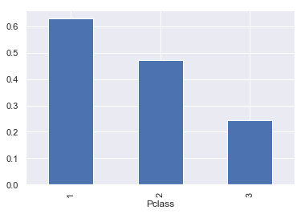
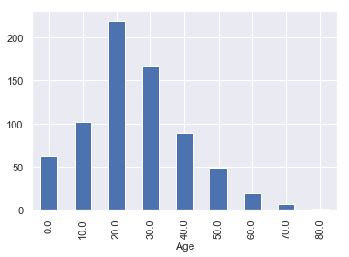
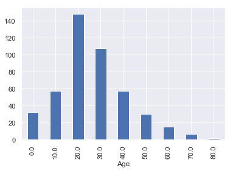

## Groupby and Aggregation (Split-Apply-Combine):

This notebook will provide a walkthrough for data **splitting** (mapping) with ```groupby()```, **apply** some action (e.g.,```count(), sum(), mean(), std()```) and finally **combine** through ```aggregation(), transform()``` action (reduction). 

Read more about these functionality from [Pydata documentation for Group by (split-apply-combine)](https://pandas.pydata.org/docs/user_guide/groupby.html)[1].
Some parts of this notebook are taken from [EuroScipy 2016 Pandas Tutorial by Joris Van den Bossche and Nicholas Devenish](https://github.com/jorisvandenbossche/pandas-tutorial)[2]


```python
import pandas as pd
import numpy as np
import seaborn as sns
import matplotlib.pyplot as plt
%matplotlib inline
sns.set()
```

#### Load data


```python
titanic = pd.read_csv('data/titanic.csv')
titanic = titanic.set_index('Name')
titanic.head(2)
```


<div>
<style scoped>
    .dataframe tbody tr th:only-of-type {
        vertical-align: middle;
    }

    .dataframe tbody tr th {
        vertical-align: top;
    }

    .dataframe thead th {
        text-align: right;
    }
</style>
<table border="1" class="dataframe">
  <thead>
    <tr style="text-align: right;">
      <th></th>
      <th>PassengerId</th>
      <th>Survived</th>
      <th>Pclass</th>
      <th>Sex</th>
      <th>Age</th>
      <th>SibSp</th>
      <th>Parch</th>
      <th>Ticket</th>
      <th>Fare</th>
      <th>Cabin</th>
      <th>Embarked</th>
    </tr>
    <tr>
      <th>Name</th>
      <th></th>
      <th></th>
      <th></th>
      <th></th>
      <th></th>
      <th></th>
      <th></th>
      <th></th>
      <th></th>
      <th></th>
      <th></th>
    </tr>
  </thead>
  <tbody>
    <tr>
      <th>Braund, Mr. Owen Harris</th>
      <td>1</td>
      <td>0</td>
      <td>3</td>
      <td>male</td>
      <td>22.0</td>
      <td>1</td>
      <td>0</td>
      <td>A/5 21171</td>
      <td>7.2500</td>
      <td>NaN</td>
      <td>S</td>
    </tr>
    <tr>
      <th>Cumings, Mrs. John Bradley (Florence Briggs Thayer)</th>
      <td>2</td>
      <td>1</td>
      <td>1</td>
      <td>female</td>
      <td>38.0</td>
      <td>1</td>
      <td>0</td>
      <td>PC 17599</td>
      <td>71.2833</td>
      <td>C85</td>
      <td>C</td>
    </tr>
  </tbody>
</table>
</div>


#### The groupby operation (split-apply-combine)
is followed by multiple functionality e.g., ```groupby.aggregate()```,```groupby.count()``` ```groupby.size()```,```groupby.mean()```. 

The "group by" concept: we want to **apply the same function on subsets of your dataframe, based on some key to split the dataframe in subsets**

This operation is also referred to as the "split-apply-combine" operation, involving the following steps:

* **Splitting** the data into groups based on some criteria
* **Applying** a function to each group independently
* **Combining** the results into a data structure


#### 1. Simple Groupby and aggregate example:
Lets create a sample dataframe to operate ```groupby()``` followed by ```size()``` and ```aggregate()``` with ```np.sum()``` seperately.


```python
df = pd.DataFrame({'key':['A','B','C','A','B','C','A','B','C'],
                   'data': [0, 5, 10, 5, 10, 15, 10, 15, 20]})
df.head(2)
```


<div>
<style scoped>
    .dataframe tbody tr th:only-of-type {
        vertical-align: middle;
    }

    .dataframe tbody tr th {
        vertical-align: top;
    }

    .dataframe thead th {
        text-align: right;
    }
</style>
<table border="1" class="dataframe">
  <thead>
    <tr style="text-align: right;">
      <th></th>
      <th>key</th>
      <th>data</th>
    </tr>
  </thead>
  <tbody>
    <tr>
      <th>0</th>
      <td>A</td>
      <td>0</td>
    </tr>
    <tr>
      <th>1</th>
      <td>B</td>
      <td>5</td>
    </tr>
  </tbody>
</table>
</div>


The ```groupby()``` operation followed by ```size()``` does not return a ```DataFrame``` object, it becomes a pandas ```Series``` object.


```python
result = df.groupby('key').size()
print("Object type:", type(result))
print(result)
```

    Object type: <class 'pandas.core.series.Series'>
    key
    A    3
    B    3
    C    3
    dtype: int64
    

The ```groupby()``` operation followed by ```aggregate()``` returns a ```DataFrame``` object.


```python
result = df.groupby('key').aggregate(np.sum)
print("object type:", type(result))
result
```

    object type: <class 'pandas.core.frame.DataFrame'>
    


<div>
<style scoped>
    .dataframe tbody tr th:only-of-type {
        vertical-align: middle;
    }

    .dataframe tbody tr th {
        vertical-align: top;
    }

    .dataframe thead th {
        text-align: right;
    }
</style>
<table border="1" class="dataframe">
  <thead>
    <tr style="text-align: right;">
      <th></th>
      <th>data</th>
    </tr>
    <tr>
      <th>key</th>
      <th></th>
    </tr>
  </thead>
  <tbody>
    <tr>
      <th>A</th>
      <td>15</td>
    </tr>
    <tr>
      <th>B</th>
      <td>30</td>
    </tr>
    <tr>
      <th>C</th>
      <td>45</td>
    </tr>
  </tbody>
</table>
</div>


#### 2. Exercise with Titanic Dataset

<div class="alert alert-success">
    <b>EXERCISE</b>: Using groupby(), calculate the total number for each sex catagory.
</div>


```python
titanic.groupby('Sex').size()
```


    Sex
    female    314
    male      577
    dtype: int64


<div class="alert alert-success">
    <b>EXERCISE</b>: Using groupby(), calculate the average age for each sex.
</div>


```python
titanic.groupby('Sex')['Age'].mean()
```


    Sex
    female    27.915709
    male      30.726645
    Name: Age, dtype: float64


<div class="alert alert-success">
    <b>EXERCISE</b>: Calculate the average survival ratio for all passengers.
</div>


```python
titanic['Survived'].sum() / len(titanic['Survived'])
```


    0.3838383838383838


<div class="alert alert-success">
    <b>EXERCISE</b>: Calculate this survival ratio for all passengers younger that 25 (remember: filtering/boolean indexing).
</div>


```python
df25 = titanic[titanic_df1['Age'] <= 25]
df25['Survived'].sum() / len(df25['Survived'])
```


    0.4119601328903654


<div class="alert alert-success">
    <b>EXERCISE</b>: Is there a difference in this survival ratio between the sexes? (tip: write the above calculation of the survival ratio as a function)
</div>


```python
def survival_ratio(survived):
    return survived.sum() / len(survived)
```


```python
titanic.groupby('Sex')['Survived'].aggregate(survival_ratio)
```


    Sex
    female    0.742038
    male      0.188908
    Name: Survived, dtype: float64


<div class="alert alert-success">
    <b>EXERCISE</b>: Make a bar plot of the survival ratio for the different classes ('Pclass' column).
</div>


```python
titanic.groupby('Pclass')['Survived'].aggregate(survival_ratio).plot(kind='bar')
pass
```





#### 3. Some advanced groupby operations

<div class="alert alert-success">
    <b>EXERCISE</b>: Find data for age distribution.
</div>


```python
df = titanic.copy(deep =True)
```


```python
df.groupby(df.Age//10 * 10).size().plot(kind='bar',figsize = [6,4])
pass
```





<div class="alert alert-success">
    <b>EXERCISE</b>: Find data for male age distribution.
</div>


```python
Male = df[df['Sex'] == 'male']
Male.groupby(Male.Age // 10 * 10).size().plot(kind='bar',figsize = [6,4])
pass
```





<div class="alert alert-success">
    <b>EXERCISE</b>: List data with Fare size greater then 50.
</div>


```python
Fare50 = df[df.Fare>50]
Fare50.groupby([ 'Sex']).size()
```


    Sex
    female    87
    male      73
    dtype: int64


```python
Fare50.groupby(['Age', 'Sex','Survived']).size().head(4)
```


    Age    Sex     Survived
    0.92   male    1           1
    2.00   female  0           1
    4.00   male    1           1
    11.00  male    1           1
    dtype: int64


#### 4. Groupby followed by transformation: ```groupby.transform()```. 
The transform operation accepts builting functions e.g., ```sum,  mean, std``` through keyword. One can define a new function called user defined function to supply inside ```transform(new_function)```.


```python
df = pd.DataFrame({'key':['A','B','C','A','B','C','A','B','C'],
                   'data': [0, 5, 10, 5, 10, 15, 10, 15, 20]})
df.head(2)
```


<div>
<style scoped>
    .dataframe tbody tr th:only-of-type {
        vertical-align: middle;
    }

    .dataframe tbody tr th {
        vertical-align: top;
    }

    .dataframe thead th {
        text-align: right;
    }
</style>
<table border="1" class="dataframe">
  <thead>
    <tr style="text-align: right;">
      <th></th>
      <th>key</th>
      <th>data</th>
    </tr>
  </thead>
  <tbody>
    <tr>
      <th>0</th>
      <td>A</td>
      <td>0</td>
    </tr>
    <tr>
      <th>1</th>
      <td>B</td>
      <td>5</td>
    </tr>
  </tbody>
</table>
</div>


```python
df.groupby('key').transform('mean').head(2)
```


<div>
<style scoped>
    .dataframe tbody tr th:only-of-type {
        vertical-align: middle;
    }

    .dataframe tbody tr th {
        vertical-align: top;
    }

    .dataframe thead th {
        text-align: right;
    }
</style>
<table border="1" class="dataframe">
  <thead>
    <tr style="text-align: right;">
      <th></th>
      <th>data</th>
    </tr>
  </thead>
  <tbody>
    <tr>
      <th>0</th>
      <td>5</td>
    </tr>
    <tr>
      <th>1</th>
      <td>10</td>
    </tr>
  </tbody>
</table>
</div>


```python
def normalize(group):
    return (group - group.mean()) / group.std()
```


```python
df.groupby('key').transform(normalize).head(2)
```


<div>
<style scoped>
    .dataframe tbody tr th:only-of-type {
        vertical-align: middle;
    }

    .dataframe tbody tr th {
        vertical-align: top;
    }

    .dataframe thead th {
        text-align: right;
    }
</style>
<table border="1" class="dataframe">
  <thead>
    <tr style="text-align: right;">
      <th></th>
      <th>data</th>
    </tr>
  </thead>
  <tbody>
    <tr>
      <th>0</th>
      <td>-1.0</td>
    </tr>
    <tr>
      <th>1</th>
      <td>-1.0</td>
    </tr>
  </tbody>
</table>
</div>


### References:
1. [Pydata documentation: Group by: split-apply-combine](https://pandas.pydata.org/docs/user_guide/groupby.html)
2. [EuroScipy 2016 Pandas Tutorial by Joris Van den Bossche and Nicholas Devenish](https://github.com/jorisvandenbossche/pandas-tutorial)
