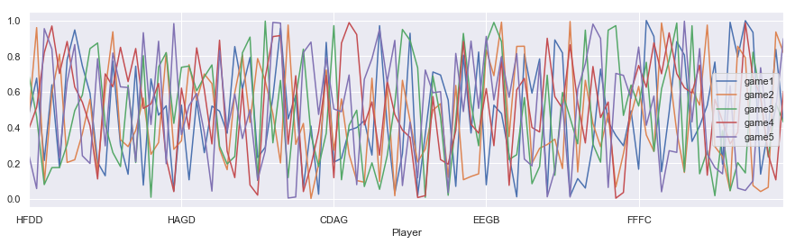
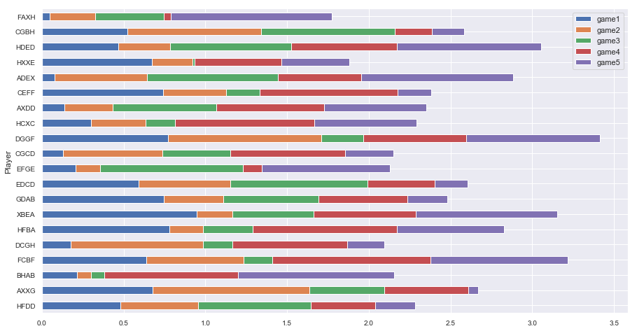
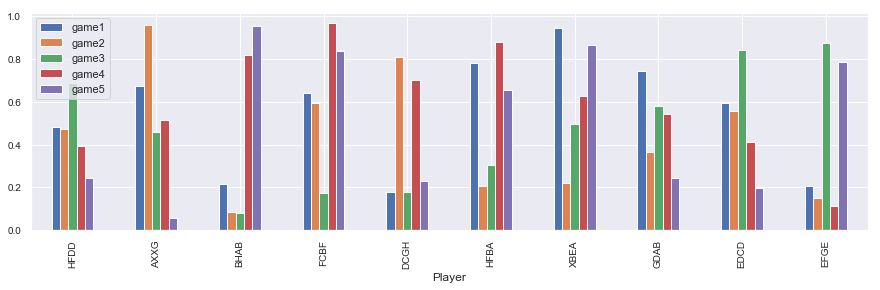
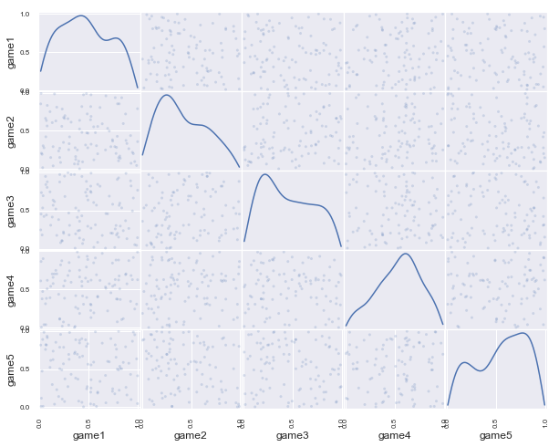
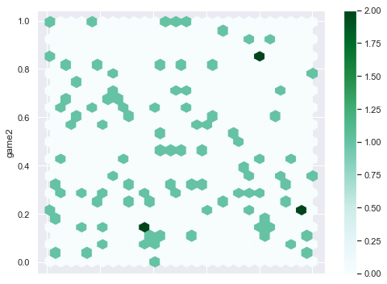

## DataFrame Preliminaries in Pandas

In this norebook ww will create some data visualization by implementing Pandas ```plot``` and other functions.


```python
import pandas as pd
import numpy as np
import random as random
import seaborn as sns
import matplotlib.pyplot as plt
%matplotlib inline
sns.set()
```

#### To create new  data frame from  list of dictionaries and visualize them.

Here we will create first a list with collection of dictionaries. Each of the dictionary will have keys and values. Using this list of dictionaries, we will create another dataframe. The keys of the dictionary will serve as the column names.


```python
LD = []
letter = ['A','B','C','D','E','F','G','H','X']
for i in range(100):
    LD.append({'Player' : random.choice(letter)+\
                          random.choice(letter)+\
                          random.choice(letter)+\
                          random.choice(letter),\
               'game1' : random.uniform(0,1),\
               'game2' : random.uniform(0,1),\
               'game3' : random.uniform(0,1),
               'game4' : random.uniform(0,1),
               'game5' : random.uniform(0,1)})
```


```python
DF = pd.DataFrame(LD)
DF=DF.set_index("Player")
DF.head(3)
```


<div>
<style scoped>
    .dataframe tbody tr th:only-of-type {
        vertical-align: middle;
    }

    .dataframe tbody tr th {
        vertical-align: top;
    }

    .dataframe thead th {
        text-align: right;
    }
</style>
<table border="1" class="dataframe">
  <thead>
    <tr style="text-align: right;">
      <th></th>
      <th>game1</th>
      <th>game2</th>
      <th>game3</th>
      <th>game4</th>
      <th>game5</th>
    </tr>
    <tr>
      <th>Player</th>
      <th></th>
      <th></th>
      <th></th>
      <th></th>
      <th></th>
    </tr>
  </thead>
  <tbody>
    <tr>
      <th>HFDD</th>
      <td>0.481069</td>
      <td>0.474633</td>
      <td>0.689590</td>
      <td>0.395129</td>
      <td>0.242217</td>
    </tr>
    <tr>
      <th>AXXG</th>
      <td>0.676598</td>
      <td>0.959418</td>
      <td>0.460717</td>
      <td>0.513393</td>
      <td>0.058434</td>
    </tr>
    <tr>
      <th>BHAB</th>
      <td>0.215308</td>
      <td>0.086760</td>
      <td>0.080839</td>
      <td>0.818904</td>
      <td>0.953768</td>
    </tr>
  </tbody>
</table>
</div>


#### Data Visualization with Pandas

- Individual columns of data can be visualized as line plot


```python
DF.plot(figsize = [15,4])
```


    <matplotlib.axes._subplots.AxesSubplot at 0x26c35149d30>





- Abar plot can be created with ```plot.barh``` for horizontal bar with extra setting ```stacked=True``` for adding contribution from each column data.


```python
DF[0:20].plot.barh(stacked=True,figsize=(15, 8),fontsize =10)
```


    <matplotlib.axes._subplots.AxesSubplot at 0x26c36740278>





- Verticle bar can be created with ```plot.bar()``` functionality with ```stacked=False``` setting.


```python
DF[0:10].plot.bar(stacked=False,figsize=(15, 4),fontsize =10)
```


    <matplotlib.axes._subplots.AxesSubplot at 0x26c37193a58>





- pandas plotting provides ```scatter_matrix``` functions to plot col by col scater plot with ```kernel density estimation- kde```.


```python
from pandas.plotting import scatter_matrix
scatter_matrix(DF, alpha=0.2, figsize=(10, 8), diagonal='kde')
plt.show()
```





- Pandas plotting also has ```plot.hexbin()``` functionality for beautiful scatter plot.


```python
DF.plot.hexbin(x='game1', y='game2',figsize=(8, 6), gridsize=25)
```


    <matplotlib.axes._subplots.AxesSubplot at 0x26c39cba128>





### Reference:
1. [Pydata visualization documentation](https://pandas.pydata.org/docs/user_guide/visualization.html)
